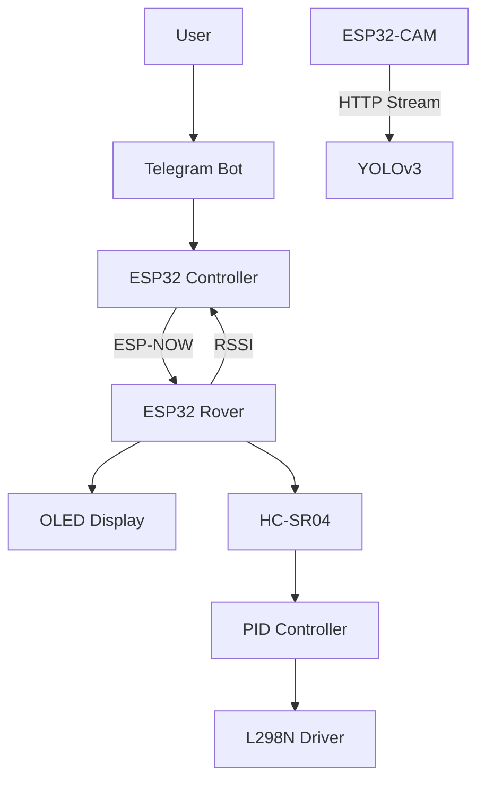
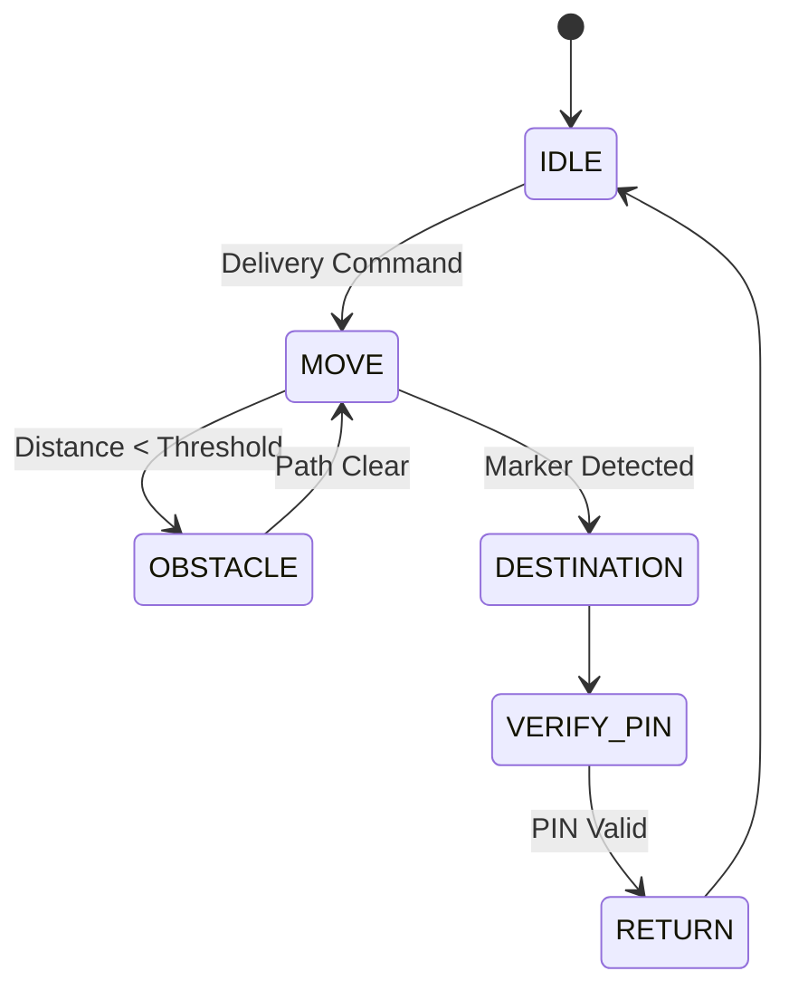

# 🤖 Autonomous Food Delivery Rover
### FreeRTOS • ESP-NOW • YOLOv3 • PID Controller • ESP32-CAM

Autonomous food delivery robot built with a distributed embedded architecture using multiple ESP32 boards.

The project combines:

- 🚗 Autonomous navigation
- 📷 Computer Vision (YOLOv3)
- 📡 ESP-NOW communication
- ⚙️ FreeRTOS multitasking
- 🎯 PID distance control
- 🔐 Telegram Bot authentication
- 📺 OLED user interface

Unlike a traditional line follower, this robot performs autonomous navigation while communicating with multiple embedded nodes in real time.

---

# 🧠 System Architecture

Robot terdiri dari tiga node utama.

## 📱 Controller Node

ESP32

Responsibilities

- Telegram Bot
- Generate PIN
- Send command
- Receive RSSI
- ESP-NOW Master

---

## 🚗 Rover Node

ESP32 + FreeRTOS

Responsibilities

- Finite State Machine
- PID Control
- Ultrasonic
- Motor Driver
- OLED Animation
- RSSI Monitoring

---

## 📷 Vision Node

ESP32-CAM

Responsibilities

- HTTP Video Streaming
- YOLOv3 Detection

---

# 🧩 System Topology



---

# ⚙️ Finite State Machine



---

# 🎯 PID Controller

Robot menggunakan algoritma Proportional-Integral-Derivative (PID) untuk mengontrol kecepatan berdasarkan jarak yang dibaca sensor ultrasonik.

## Rumus Umum

\[
e(t)=SP-PV
\]

Keterangan:

- `SP` = Set Point (jarak target)
- `PV` = Process Variable (jarak aktual)
- `e(t)` = Error

---

### Proportional (P)

\[
P=K_p \times e(t)
\]

Menghasilkan respon yang sebanding dengan besar error.

---

### Integral (I)

\[
I=K_i \times \int e(t)\,dt
\]

Mengakumulasi error dari waktu ke waktu sehingga mampu mengurangi steady-state error.

Implementasi diskrit:

\[
I=K_i \times \sum e
\]

---

### Derivative (D)

\[
D=K_d \times \frac{de(t)}{dt}
\]

Menghitung perubahan error untuk mengurangi overshoot.

Implementasi diskrit:

\[
D=K_d \times (e_{now}-e_{previous})
\]

---

### Output PID

\[
Output=P+I+D
\]

atau

\[
Output=K_p e + K_i \int e\,dt + K_d \frac{de}{dt}
\]

---

## Parameter PID

| Parameter | Value |
|-----------|------:|
| Kp | 3.0 |
| Ki | 0.5 |
| Kd | 1.0 |

---

## PID Flow

```text
Target Distance
        │
        ▼
Calculate Error
        │
        ▼
P + I + D
        │
        ▼
PWM Motor
        │
        ▼
Robot Movement
        │
        ▼
Ultrasonic Feedback
        │
        └──────────────┐
                       ▼
               Calculate Error
```
---

# ⚡ FreeRTOS Tasks

| Task | Function |
|------|----------|
| Navigation Task | FSM Navigation |
| ESP-NOW Task | Communication |
| OLED Task | Animation |
| Sensor Task | Ultrasonic |
| Queue Task | Command Processing |

---

# 📦 Queue Communication

```
Telegram

↓

ESP-NOW

↓

Queue

↓

FSM

↓

Motor
```

Queue digunakan supaya setiap command diproses secara berurutan tanpa blocking.

---

# 📡 Wireless Communication

Protocol

ESP-NOW

Channel

13

Data

- Command
- RSSI
- Navigation
- Status

---

# 👁 Computer Vision

Robot menggunakan metode:

## YOLOv3

- Object Detection
- Human Detection
- Delivery Validation

---

# 🖥 OLED Animation

Robot memiliki beberapa ekspresi.

- 😊 Senyum
- 😐 Normal
- 😮 Kaget
- 😠 Marah
- 😭 Nangis
- 🙂 Tulus

Ekspresi berubah mengikuti kondisi robot secara real-time.

---

# 🔐 Telegram Authentication

Flow

User

↓

Telegram Bot

↓

Random PIN

↓

Robot

↓

Input PIN

↓

Valid

↓

Robot Return

---

# 🛠 Hardware

## Receiver

| Component | GPIO |
|-----------|------|
| L298N | 12 13 14 33 |
| PWM | 15 26 |
| HC-SR04 | 16 17 |
| OLED | SDA 21 SCL 22 |

---

## Trasnmitter

| Component | GPIO |
|-----------|------|
| Buzzer | 16 |
| Indicator LED | 12 13 14 |

---

# 💻 Software Stack

- Visual Studio Code
- FreeRTOS
- ESP-NOW
- PubSubClient
- ESP32Servo
- ArduinoJson
- OpenCV
- YOLOv3
- Python

---

# 🚀 Features

- ✅ ESP-NOW
- ✅ FreeRTOS
- ✅ Queue
- ✅ PID
- ✅ OLED UI
- ✅ Telegram Bot
- ✅ RSSI Monitoring
- ✅ ArUco Navigation
- ✅ YOLOv3
- ✅ Retry Marker
- ✅ Autonomous Delivery

---