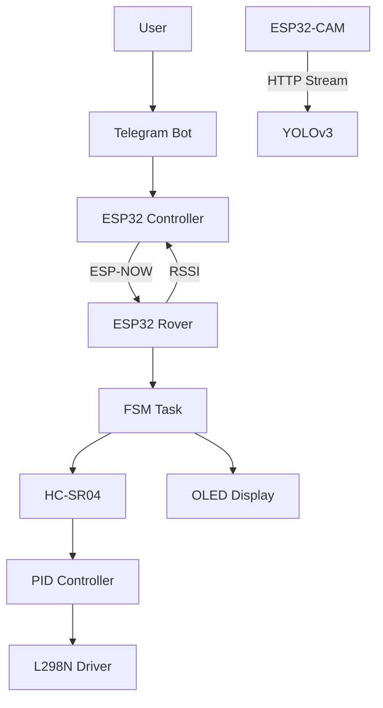
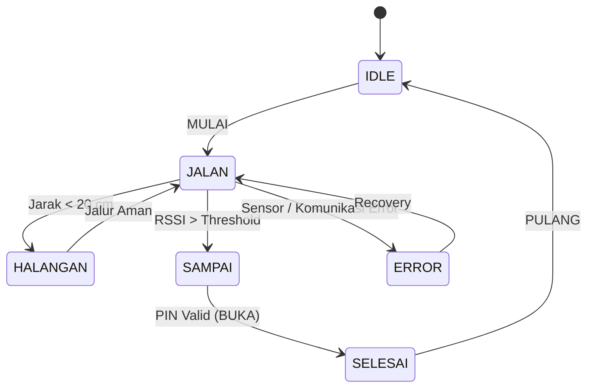

# 🤖 Autonomous Food Delivery Rover
### FreeRTOS • ESP-NOW • YOLOv3 • PID Controller • ESP32-CAM

Autonomous food delivery robot built with a distributed embedded architecture using multiple ESP32 boards.

The project combines:

- 🚗 Autonomous navigation
- 📷 Computer Vision (YOLOv3)
- 📡 ESP-NOW communication
- ⚙️ FreeRTOS multitasking
- 🎯 PID distance control
- 🔐 Telegram Bot authentication
- 📺 OLED user interface

Unlike a traditional line follower, this robot performs autonomous navigation while communicating with multiple embedded nodes in real time.

---

# 🧠 System Architecture

Robot terdiri dari tiga node utama.

## 📱 Controller Node

ESP32 devkit v4

Responsibilities

- Telegram Bot
- Generate PIN
- Send command
- Receive RSSI
- ESP-NOW Master

---

## 🚗 Rover Node

ESP32 devkit v1 + FreeRTOS

Responsibilities

- Finite State Machine
- PID Control
- Ultrasonic
- Motor Driver
- OLED Animation
- RSSI Monitoring

---

## 📷 Vision Node

ESP32-CAM

Responsibilities

- HTTP Video Streaming
- Image Acquisition

Notes:
- Inferensi YOLOv3 dijalankan pada laptop menggunakan OpenCV dan Python.

---

# 🧩 System Topology



---

# ⚙️ Finite State Machine



---

# 🎯 PID Control
Robot menggunakan algoritma Proportional-Integral-Derivative (PID) untuk mengontrol kecepatan berdasarkan jarak yang dibaca sensor ultrasonik.

### Proportional (P)

Formula

`P = Kp × e(t)`

Keterangan:
- Kp = proportional gain
- e(t) = error

Menghasilkan respon yang sebanding dengan besar error.

---

### Integral (I)

Formula

`I = Ki × ∫e(t)dt`

Implementasi diskrit:

`I = Ki × Σe`

Mengurangi steady-state error dengan mengakumulasi error.

---

### Derivative (D)

Formula

`D = Kd × (de/dt)`

Implementasi diskrit:

`D = Kd × (error - lastError) / dt`

Memprediksi perubahan error sehingga mengurangi overshoot.

---

### PID Output

`Output = P + I + D`

atau

`u(t) = Kp·e(t) + Ki∫e(t)dt + Kd(de(t)/dt)`
 
---

## Parameter PID

| Parameter | Value |
|-----------|------:|
| Kp | 3.72 |
| Ki | 2.58 |
| Kd | 1.67 |

---

## PID Flow

```text

Target Distance
        │
        ▼
HC-SR04 Measurement
        │
        ▼
Calculate Error
        │
        ▼
PID Controller
        │
        ▼
PWM Output
        │
        ▼
Motor Driver
        │
        ▼
Pergerakan Robot
        │
        ▼
Pembacaan HC-SR04
        └───────────────┐
                        ▼
                Calculate Error

```
---

# ​🛡️ Fail-Safe Mechanism: 
Memiliki sistem deteksi error otomatis. Jika terjadi timeout komunikasi ESP-NOW lebih dari 1000ms atau pembacaan sensor ultrasonik tidak valid, robot akan otomatis menghentikan motor dan menampilkan indikator error secara visual untuk mencegah kecelakaan (Runaway condition).

---

# ⚡ FreeRTOS Tasks

| Task | Function |
|------|----------|
| FSM Task |Robot state management and Navigation |
| ESP-NOW Callback | Receive wireless commands |
| Ultrasonic Task | Distance measurement |
| Queue  | Command buffering between ESP-NOW and FSM |
| Monitoring Task | System monitoring and debugging |
| OTA Task | Handles firmware updates and suspends/resumes RTOS tasks during OTA |

---

# 📡 Over-The-Air (OTA) Update
Robot mendukung pembaruan firmware melalui jaringan WiFi menggunakan fitur OTA (Over-The-Air), sehingga proses pengembangan dan tuning parameter tidak lagi memerlukan koneksi USB Manual

## Mekanisme OTA

PlatformIO

↓

WiFi

↓

OTA Task

↓

Suspend Task RTOS

↓

Firmware Upload

↓

Resume Task

↓

Robot Berjalan Kembali

## Cara Kerja

- OTA berjalan pada task terpisah.
- Saat proses upload dimulai, sistem mengaktifkan `otaMode`.
- Task navigasi, pembacaan sensor, dan monitoring dihentikan sementara menggunakan `vTaskSuspend()`.
- OLED menampilkan progress OTA tanpa terganggu animasi FSM.
- Setelah upload selesai, seluruh task diaktifkan kembali menggunakan `vTaskResume()`.

## Keuntungan

- Tidak perlu mencabut dan memasang kabel USB setiap kali melakukan perubahan program.
- Proses tuning PID menjadi lebih cepat.
- Menghindari konflik akses CPU selama proses upload firmware.
- Mencegah glitch pada tampilan OLED ketika OTA berlangsung.

---

# 📦 Queue Communication

```
Telegram Bot

↓

ESP32 Controller

↓

ESP-NOW

↓

ESP-NOW Receive Callback

↓

xQueueSendFromISR()

↓

FreeRTOS Queue

↓

FSM Task

↓

Motor Driver

```

Queue digunakan supaya setiap command diproses secara berurutan tanpa blocking

---

# 📊 Monitoring Sistem

Robot secara berkala menampilkan informasi debugging melalui Serial Monitor.

Data yang dipantau meliputi:

- State FSM
- Nilai RSSI
- Jarak HC-SR04
- Jenis Error Aktif
- Status Recovery

Monitoring ini digunakan untuk mempermudah proses debugging selama pengembangan.

---

# 🛠 Tantangan dan Solusi

## 1. Timeout Komunikasi ESP-NOW

Tantangan

Robot dapat kehilangan komunikasi akibat paket ESP-NOW tidak diterima dalam waktu tertentu.

Solusi

Menambahkan mekanisme timeout selama 1000 ms. Apabila komunikasi terputus, robot berpindah ke state ERROR, menghentikan motor, dan kembali ke mode operasi ketika komunikasi telah pulih.

---

## 2. Pembacaan Sensor Ultrasonik Tidak Valid

Tantangan

Sensor HC-SR04 dapat menghasilkan pembacaan tidak valid (timeout atau jarak di luar rentang).

Solusi

Melakukan validasi data sensor dan menghitung jumlah error secara berurutan. Robot akan masuk ke mode fail-safe apabila jumlah error melebihi batas yang ditentukan.

---

## 3. Pemrosesan Perintah Tanpa Mengganggu FSM

Tantangan

Perintah yang diterima melalui ESP-NOW tidak boleh langsung mengubah state robot karena dapat menyebabkan konflik dengan proses navigasi.

Solusi

Menggunakan FreeRTOS Queue sebagai media komunikasi antara callback ESP-NOW dan FSM sehingga setiap perintah diproses secara berurutan.

---

## 4. Pengendalian Kecepatan Robot

Tantangan

Kecepatan robot harus menyesuaikan jarak terhadap target agar tidak menabrak maupun berhenti terlalu jauh.

Solusi

Mengimplementasikan algoritma PID untuk mengatur nilai PWM motor berdasarkan error jarak yang dibaca sensor ultrasonik.

---

## 5. Keterbatasan Komputasi ESP32-CAM

Tantangan

ESP32-CAM tidak memiliki sumber daya yang cukup untuk menjalankan inferensi YOLOv3 secara langsung.

Solusi

ESP32-CAM hanya digunakan sebagai perangkat HTTP video streaming, sedangkan proses inferensi YOLOv3 dijalankan pada laptop menggunakan OpenCV dan Python.

---

## 6. Ambiguitas Pembacaan Sensor Jarak

Tantangan

Sensor ultrasonik HC-SR04 tidak dapat membedakan dua kondisi yang secara fisik menghasilkan pembacaan serupa: keberadaan penghalang di jalur navigasi (obstacle) dan posisi robot yang telah sampai di depan titik tujuan. Pada pengujian awal, ketika prioritas deteksi hanya berdasarkan jarak, robot secara keliru mendeteksi kondisi sebagai HALANGAN meskipun secara aktual robot telah berada pada titik tujuan, sehingga transisi ke state SAMPAI tidak tereksekusi.

Solusi

Untuk mengatasi ambiguitas tersebut, sistem menggabungkan pembacaan sensor ultrasonik dengan indikator kekuatan sinyal (RSSI) dari komunikasi ESP-NOW sebagai data pelengkap. Ketika RSSI menunjukkan robot berada pada jangkauan dekat dengan node tujuan namun nilai RSSI belum sepenuhnya melewati ambang batas utama, sementara jarak yang terbaca juga berada pada rentang dekat, sistem akan memprioritaskan interpretasi tersebut sebagai kondisi SAMPAI. Pendekatan ini memungkinkan sistem melakukan disambiguasi antara kondisi obstacle dan kondisi telah sampai tujuan menggunakan dua sumber data yang saling melengkapi.

---

## 7. Integrasi OTA dengan Sistem Multi-Task FreeRTOS

Tantangan

Robot memerlukan proses tuning PID yang cukup sering sehingga firmware harus diunggah berkali-kali. Menggunakan kabel USB setiap kali melakukan perubahan cukup merepotkan karena robot bersifat mobile. Solusinya adalah menambahkan fitur OTA (Over-The-Air).

Namun setelah OTA diintegrasikan ke sistem FreeRTOS, muncul beberapa masalah baru.

Upload firmware sering gagal (WinError 10053).

Progress OTA bertabrakan dengan animasi OLED yang masih dijalankan oleh FSM.

Beberapa task masih mengakses resource yang sama ketika proses update berlangsung.


Solusi

OTA dijalankan menggunakan task khusus (otaTask) yang secara terus menerus menangani proses ArduinoOTA.handle().

Ketika proses update dimulai:

Mode OTA diaktifkan.

FSM Task dihentikan sementara.

Ultrasonic Task dihentikan sementara.

Monitoring Task dihentikan sementara.

OLED menampilkan tampilan khusus proses OTA.


Setelah proses update selesai maupun gagal:

Seluruh task dijalankan kembali.

Robot kembali ke kondisi normal.

---

# 📡 Wireless Communication

Protocol

ESP-NOW

Role

peer to peer Communications

Channel

13

Data

- Command
- RSSI
- Navigation
- Status

---

# 👁 Computer Vision

Robot menggunakan metode:

## YOLOv3

- Object Detection
- Human Detection

---

# 🖥 OLED Animation

Robot memiliki beberapa ekspresi.

- 😊 Senyum
- 😐 Normal
- 😮 Kaget
- 😠 Marah
- 😭 Nangis
- 🙂 Tulus

Ekspresi berubah mengikuti kondisi robot secara real-time.

---

# 🔐 Telegram Authentication

Flow

User

↓

Telegram Bot

↓

Random PIN

↓

Robot

↓

Input PIN

↓

Valid

↓

Robot Return

---

# 🛠 Hardware

## Receiver

| Component | GPIO |
|-----------|------|
| L298N | 12 13 14 33 |
| PWM | 15 26 |
| HC-SR04 | 16 17 |
| OLED | SDA 21 SCL 22 |

---

## Transmitter

| Component | GPIO |
|-----------|------|
| Buzzer | 16 |
| Indicator LED | 12 13 14 |

---

# 💻 Software Stack

- Visual Studio Code
- PlatformIO Extension
- FreeRTOS
- Queue
- ESP-NOW
- ArduinoOTA
- OpenCV
- YOLOv3
- Python

---

# 🚀 Features

- ✅ ESP-NOW
- ✅ FreeRTOS
- ✅ Queue
- ✅ PID
- ✅ OLED UI
- ✅ Telegram Bot
- ✅ RSSI Monitoring
- ✅ YOLOv3
- ✅ Autonomous Delivery
- ✅ OTA firmware update

---

# 📈 Future Development

- Dynamic obstacle avoidance
- Battery level monitoring
- Automatic docking
- Multiple rover communication
- SLAM-based navigation

---